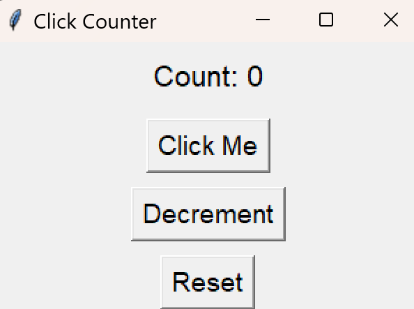

# 🖱️ Click Counter

A beginner-friendly GUI app built with Python and Tkinter.

## 🎮 Features

- Button that increases a visible count
- Reset button to return to zero
- Decrement button to decrease the count

## 🚀 How to Run

```bash
python main.py
```


